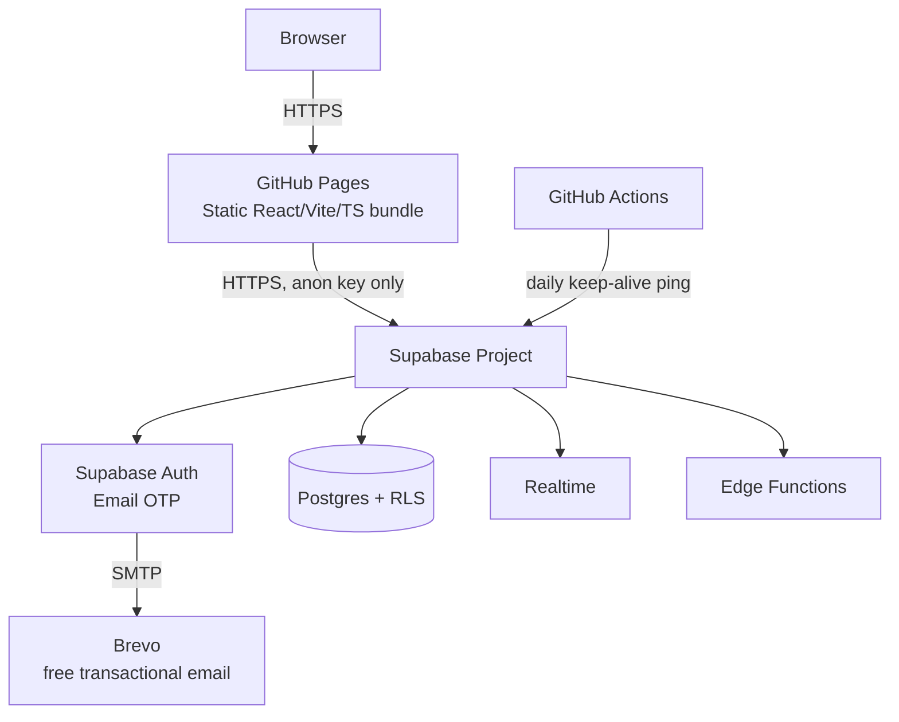
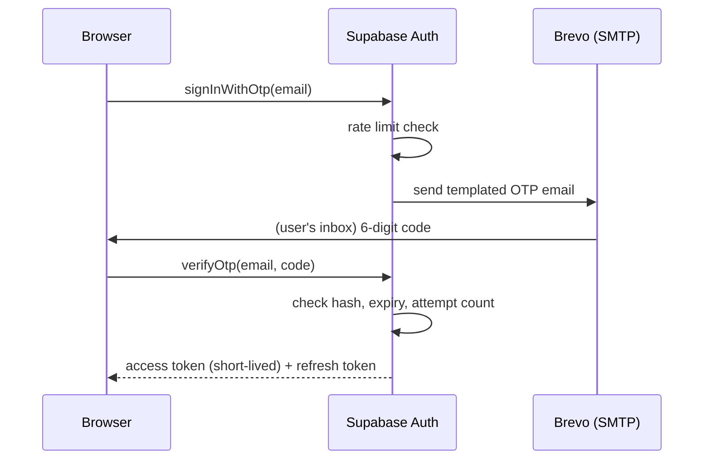
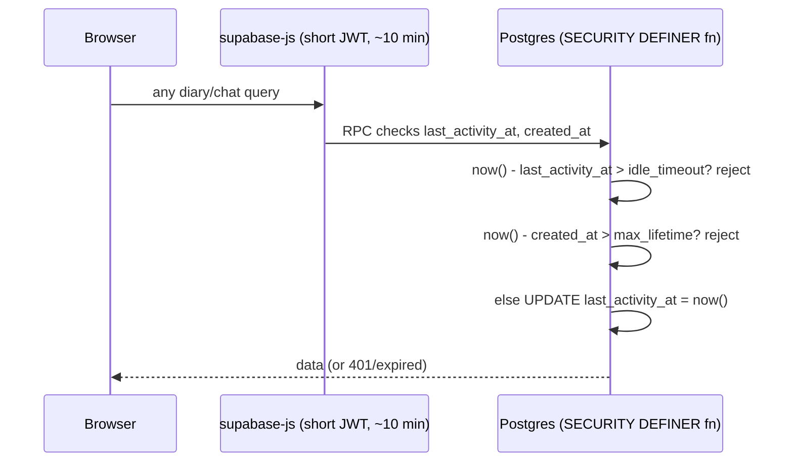

# MindTrack — Architecture

Status: Phase 1 (planning). No application code has been written yet.
Last verified against Supabase and provider documentation: **August 28, 2026**.

## 1. System overview

GitHub Pages hosts **only** static, public frontend assets. Every private byte of
data — diary entries, moods, chat messages, secret codes — lives behind Supabase
Auth + Row Level Security. Nothing bundled by Vite is ever treated as secret,
because anything shipped to GitHub Pages is public by construction.

## 2. Why this stack

- **Zero recurring cost** for a 2-user application, using only documented free
  tiers (Supabase Free, GitHub Pages, GitHub Actions, Brevo Free).
- **No backend server to operate.** Postgres RLS policies and Supabase Edge
  Functions are the entire "backend" — nothing to patch, restart, or pay to keep
  warm beyond the free-tier pause described below.
- **Small enough to actually secure.** Two users, one Postgres database, no
  microservices, no message queue, no Redis. Complexity is the enemy of security
  in a project this size.

## 3. Verified free-tier constraints (do not assume these; re-check before relying on them long-term)

| Area | Verified fact (Aug 2026) | Design consequence |
|---|---|---|
| Supabase default auth email | ~2 emails/hour, delivers **only to org members** since a June 2026 anti-phishing change | Cannot use default sender for 2 independent users. Use custom SMTP. |
| Custom SMTP provider | Resend's no-domain sandbox (`onboarding@resend.dev`) delivers **only to the Resend account owner** | Cannot serve 2 real recipients without a domain. Use **Brevo** free plan (300/day, single verified sender email, arbitrary recipients, no domain required). |
| Session idle timeout / max lifetime | **Pro-plan-only feature** in Supabase Auth dashboard (confirmed in Supabase docs: "This feature is only available on Pro Plans and up") | Implement idle timeout & absolute max lifetime ourselves via a `SECURITY DEFINER` Postgres function checked on every session-bound query, not the dashboard toggle. |
| Project auto-pause | Free projects pause after **7 days with no API traffic** | Daily GitHub Actions cron hits a trivial read-only Edge Function to keep the project warm. Documented, not hidden. |
| Database backups | **No downloadable backups, no PITR on Free** | Documented honestly in `SECURITY.md`; no claim of durability beyond what's true. |
| DB / Storage / Egress | 500 MB DB, 1 GB storage, 5 GB egress/mo | Enormous headroom for 2 users writing text entries. Monitored, not a design constraint. |
| Realtime | 200 concurrent connections, 2M messages/mo, 256 KB message cap | More than sufficient for 2 users' occasional chat sessions; used for the ephemeral chat per your choice. |
| Edge Functions | 500,000 invocations/mo | Ample; used for admin actions, secret-code issuance/redemption, and the keep-alive ping. |
| GitHub Pages headers | **No server-configurable HTTP response headers** — only a `<meta http-equiv="Content-Security-Policy">` tag is possible, and it cannot express `frame-ancestors`, `report-uri`, or `Strict-Transport-Security` | Documented gap in `SECURITY.md`. We do not claim header protections that GitHub Pages cannot serve. |
| SPA routing on GitHub Pages | No native rewrite rules | 404.html fallback + client-side router history handling (documented in deployment.md). |

## 4. Authentication flow (Email OTP)

- No passwords. No SMS (confirmed no free SMS path exists for this architecture).
- Generic responses on request ("If this email is registered, a code has been sent") — no account-enumeration signal.
- OTP expiry, resend cooldown, and max-attempt lockout use Supabase Auth's built-in
  configurable rate limits (`/auth/rate-limits`), backed by our own attempt-counter
  in Postgres for defense in depth.

## 5. Session-expiration flow (application-level, since Free tier lacks the Pro toggle)

The frontend countdown shown in the UI is cosmetic. Every actual data access is
re-validated server-side against `session_activity`, so a stolen/replayed JWT
past its idle window is rejected regardless of what the client believes.

## 6. Secret-code flow

See `docs/database.md` (Phase 2) for the schema. Summary: admin triggers an Edge
Function → cryptographically random code generated server-side → only the hash
is persisted → plaintext returned once to the admin's response payload only →
redemption is a single atomic transaction checking hash, expiry, attempts,
revocation, and one-time-use, entirely server-side.

## 7. Ephemeral chat flow

Realtime (per your selection) delivers new messages to the recipient's
subscribed channel. "Read" is acknowledged by the client, which triggers an
atomic `UPDATE ... RETURNING` immediately followed by delete inside a single
Postgres transaction, scoped to `recipient_id = auth.uid()`. This makes a
duplicate ack from a second tab a harmless no-op rather than an error or a
resurrection. Documented residual risk: this cannot guarantee no copy exists in
browser memory, OS-level caches, screenshots, or Supabase's own transient
infrastructure logs — and we will not claim otherwise in `SECURITY.md`.

## 8. Deployment flow

Documented in full in `docs/deployment.md` (produced in the deployment phase).
Summary: Supabase project + migrations + RLS + Brevo SMTP configured manually
once (dashboard), frontend built by GitHub Actions and pushed to GitHub Pages,
Supabase anon key (public by design) baked into the build via `.env` at build
time, service-role key **never** touches the frontend or a GitHub Actions log.

## 9. What is intentionally *not* built

Per your explicit constraint: no microservices, no Kubernetes, no Redis, no
message queue, no third-party analytics, no custom auth system, no SMS. The
entire backend surface is Supabase Postgres + RLS + a small number of Edge
Functions for the operations that must not be client-trusted (secret-code
issuance/redemption, admin actions, session-expiry RPCs).
